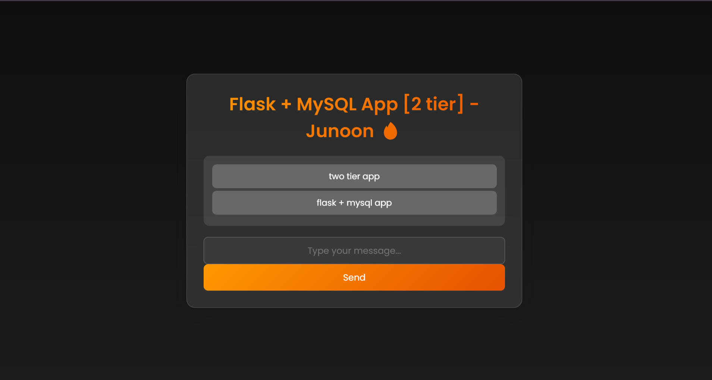
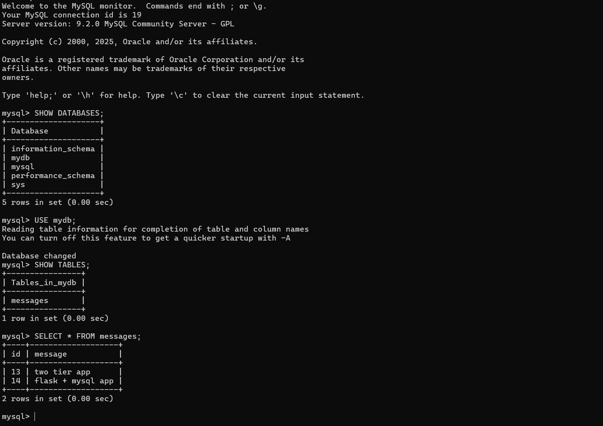
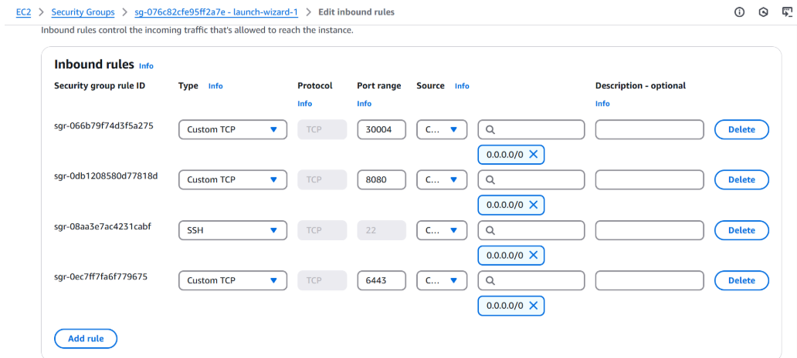

## 🚀Two-Tier Flask App with MySQL Database on Kubernetes

This project demonstrates setting up a **Kubernetes cluster** on **AWS EC2 instances**, deploying a **MySQL database**, and integrating it with a **two-tier application**.

 

## MySql Databse 
 
## Prerequisites

Before you begin, make sure you have the following installed:

- Docker
- Github (optional, for cloning the repository)
- AWS Account 

## Steps

### ✅ Step 1: Set Up EC2 Instances (Master & Worker)
1. Launch two EC2 instances: one for the **Master Node** and one for the **Worker Node**.
2. Configure **Security Groups** to allow communication between the nodes.

### ✅ Step 2: Install Kubernetes using Kubeadm
1. Install **Kubeadm** on both the Master and Worker nodes.
2. Initialize the **Master node** with `kubeadm init` and configure **kubectl**.
3. Join the **Worker node** to the cluster using `kubeadm join`.
4. Check if both nodes are connected with `kubectl get nodes`.

For detailed installation steps, refer to the [Kubeadm Installation Documentation](https://github.com/LondheShubham153/kubestarter/tree/main/Kubeadm_Installation_Scripts_and_Documentation).

### ✅ Step 3: Set Up Docker and Docker Compose ( just to verify that app is working or not)
## Setup

1. Clone this repository (if you haven't already):

   ```bash
   git clone https://github.com/your-username/your-repo-name.git
   ```

2. Navigate to the project directory:

   ```bash
   cd your-repo-name
   ```

3. Create a `.env` file in the project directory to store your MySQL environment variables:

   ```bash
   touch .env
   ```

4. Open the `.env` file and add your MySQL configuration:

   ```
   MYSQL_HOST=mysql
   MYSQL_USER=your_username
   MYSQL_PASSWORD=your_password
   MYSQL_DB=your_database
   ```

## Usage

1. Start the containers using Docker Compose:

   ```bash
   docker-compose up --build
   ```

2. Access the Flask app in your web browser:

   - Frontend: http://localhost
   - Backend: http://localhost:5000

3. Create the `messages` table in your MySQL database:

   - Use a MySQL client or tool (e.g., phpMyAdmin) to execute the following SQL commands:
   
     ```sql
     CREATE TABLE messages (
         id INT AUTO_INCREMENT PRIMARY KEY,
         message TEXT
     );
     ```

4. Interact with the app:

   - Visit http://localhost to see the frontend. You can submit new messages using the form.
   - Visit http://localhost:5000/insert_sql to insert a message directly into the `messages` table via an SQL query.

## Cleaning Up

To stop and remove the Docker containers, press `Ctrl+C` in the terminal where the containers are running, or use the following command:

```bash
docker-compose down
```

## To run this two-tier application using  without docker-compose

- First create a docker image from Dockerfile
```bash
docker build -t flaskapp .
```

- Now, make sure that you have created a network using following command
```bash
docker network create twotier
```

- Attach both the containers in the same network, so that they can communicate with each other

i) MySQL container 
```bash
docker run -d \
    --name mysql \
    -v mysql-data:/var/lib/mysql \
    --network=twotier \
    -e MYSQL_DATABASE=mydb \
    -e MYSQL_ROOT_PASSWORD=admin \
    -p 3306:3306 \
    mysql:5.7

```
ii) Backend container
```bash
docker run -d \
    --name flaskapp \
    --network=twotier \
    -e MYSQL_HOST=mysql \
    -e MYSQL_USER=root \
    -e MYSQL_PASSWORD=admin \
    -e MYSQL_DB=mydb \
    -p 5000:5000 \
    flaskapp:latest

```

## Notes

- Make sure to replace placeholders (e.g., `your_username`, `your_password`, `your_database`) with your actual MySQL configuration.


### ✅ Step 4: Create Kubernetes YAML Files

This step involves creating YAML files to define and deploy the MySQL database and two-tier application on Kubernetes.

#### **MySQL Deployment**
1. **`mysql-deployment.yml`**: Defines the MySQL container, environment variables, and resource limits.
2. **`mysql-pv.yml` (Persistent Volume)**: Defines the storage for MySQL, ensuring data persists even if the Pod restarts.
3. **`mysql-pvc.yml` (Persistent Volume Claim)**: Requests the storage defined in `mysql-pv.yml` for MySQL. This ensures MySQL data is stored persistently.
4. **`mysql-svc.yml`**: Exposes MySQL to the two-tier application and other services within the cluster.

#### **Two-Tier Application Deployment**
1. **`two-tier-app-deployment.yml`**: Defines the deployment for the two-tier application (front-end and back-end).
2. **`two-tier-app-pod.yml`**: Defines the Pod for the application and its configuration.
3. **`two-tier-app-svc.yml`**: Exposes the application to external clients or other services.

#### **Why PVCs Matter**
- **Persistence**: PVCs ensure MySQL data remains even when Pods restart.
- **Storage Abstraction**: PVCs decouple storage from Pods, making it easier to manage and scale storage.

Once all YAML files are created, apply them with `kubectl`:
```bash
kubectl apply -f <file_name>.yml
```

### ✅ Security Group Setup

1. **Enable Inbound Rule for Port 30004**:
   - Go to your EC2 instances in the AWS Management Console.
   - Navigate to **Security Groups** and select the security group associated with your EC2 instances.
   - Add an **Inbound rule** to allow TCP traffic on port **30004** to make your application accessible externally.
   
2. **Verify Security Group Rules**:
   - Ensure that the inbound rule allows traffic from your IP or the public internet (0.0.0.0/0) depending on your security requirements.
     

     
### Your application is now running! 🎉

You can access the Flask application through the exposed port on your EC2 instance. Open your browser and navigate to http://<EC2_Instance_IP>:30004 to see the app in action. 
